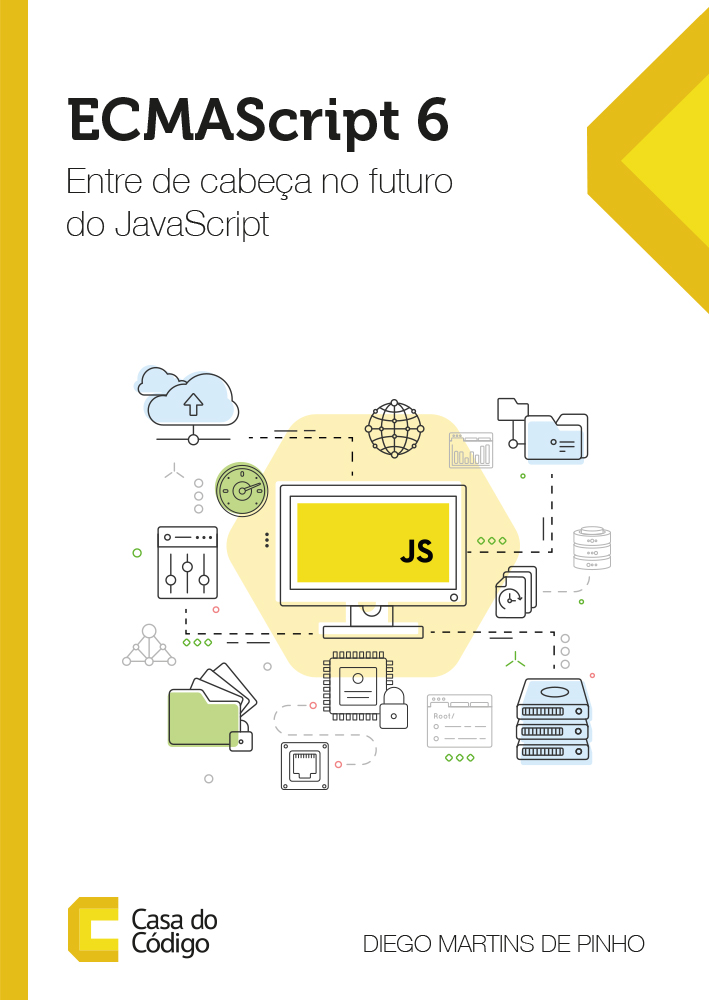

ECMAScript 6 - Entre de cabeça do futuro do JavaScript
======================
Repositório oficial do livro: ECMAScript 6 - Entre de cabeça do futuro do JavaScript

Seja muito bem-vindo a uma nova era do JavaScript! O ECMAScript 6 é a maior evolução da linguagem desde a sua criação há 20 anos! Ela agora está muito mais dinâmica, clara e gostosa de se trabalhar. Neste repositório, você encontrará todos os recursos disponíveis para acompanhar a leitura do livro "ECMAScript 6: Entre de cabeça no futuro do JavaScript".

Como estudar
------
Este repositório está dividido da mesma maneira que o livro. Cada diretório corresponde a um capítulo do livro e possui pelo menos dois arquivos:
* exercicios.md
* gabarito.md

Após ler o capítulo no livro, acesse os exercícios do capítulo correspondente e tente resolvê-los. Você pode desenvolvê-los na sua máquina local ou utilizar algum interpretador JavaScript online. Recomendo o [repl>it](https://repl.it/languages/javascript). Se conseguir resolver, continue treinando! Caso trave ou tenha algum problema, você pode consultar o gabarito. Lá você encontrará a solução recomendada para o problema (normalmente existem inúmeras soluções para um único problema, coloquei apenas uma sugestão de solução que segue as boas práticas apresentadas no livro).

Bons códigos!

Obrigado!

Dados do livro
------
**Número de páginas:** 206 

**ISBN:** 978-85-5519-258-6

------
Tendo algum dúvida, crítica, sugestão ou até mesmo encontrar um erro, não hesite em entrar em contato! Também fique a vontade para fazer um fork neste projeto e fazer sugestões de exercícios.

**ECMAScript 6 - Entre de cabeça no futuro do JavaScript** © 2017+, Diego Martins de Pinho. Publicado pela editora [Casa do Código](https://www.casadocodigo.com.br/). Todos os direitos reservados.

> Site oficial [entendendoes6.com.br](http://entendendoes6.com.br) &nbsp;&middot;&nbsp;
> Twitter [@entendendoes6](https://twitter.com/entendendoes6) &nbsp;&middot;&nbsp;
> Facebook [/entendendoes6](https://www.facebook.com/entendendoes6/) &nbsp;&middot;&nbsp;
